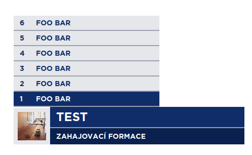
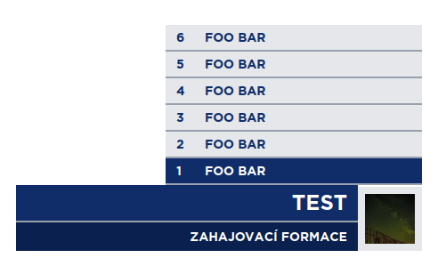
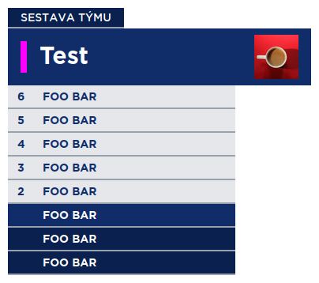
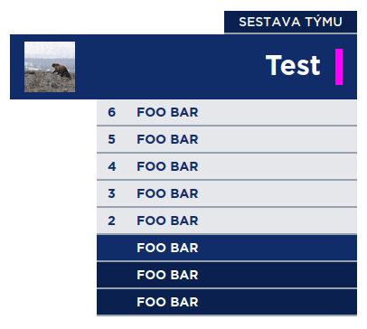

# Graphical Overlay for Floorball Streams
These graphics are 

## Themes

## Components

### Goal Tag
Displays goal scorer's name and assist.


```js
const data = {
    theme: "modra",
    time: "15:25",
    goal: "Foo Bar",
    assist: "Bar Foo",
    logo: "https://picsum.photos/200"
}

update(JSON.stringify(data));
play();
```


### Formation (Home)
Displays team's formation on the left side of the screen.



```js
update(JSON.stringify({theme: "modra", home: { name: "Test", logo: "https://picsum.photos/200", players: [{post: "U", name: "Foo Bar", number: 6}, {post: "U", name: "Foo Bar", number: 5}, {post: "U", name: "Foo Bar", number: 4}, {post: "O", name: "Foo Bar", number: 3}, {post: "O", name: "Foo Bar", number: 2}, {post: "G", name: "Foo Bar", number: 1}] }}));
```

### Formation (Away)
Displays team's formation on the right side of the screen.



```js
update(JSON.stringify({theme: "modra", away: { name: "Test", logo: "https://picsum.photos/200", players: [{post: "U", name: "Foo Bar", number: 6}, {post: "U", name: "Foo Bar", number: 5}, {post: "U", name: "Foo Bar", number: 4}, {post: "O", name: "Foo Bar", number: 3}, {post: "O", name: "Foo Bar", number: 2}, {post: "G", name: "Foo Bar", number: 1}] }}));
```

### Roster (Home)
Displays team's roster on the left side of the screen.



```js
const data = {
    theme: "modra",
    team: {
        name: "Test",
        logo: "https://picsum.photos/200",
        color: "#FF00FF",
        players: [
            {
                post: "U",
                name: "Foo Bar",
                number: 6
            },
            {
                post: "U",
                name: "Foo Bar",
                number: 5
            },
            {
                post: "U",
                name: "Foo Bar",
                number: 4
            }, 
            {
                post: "O",
                name: "Foo Bar",
                number: 3
            },
            {
                post: "O",
                name: "Foo Bar",
                number: 2
            }, 
            {
                post: "G",
                name: "Foo Bar",
                number: 0
            }, 
            {
                post: "R",
                name: "Foo Bar",
                number: -1,
            },
            {
                post: "R",
                name: "Foo Bar",
                number: -2,
            }
        ]
    }
}

update(JSON.stringify(data));
play();
```

### Roster (Away)
Displays team's roster on the right side of the screen.



```js
const data = {
    theme: "modra",
    team: {
        name: "Test",
        logo: "https://picsum.photos/200",
        color: "#FF00FF",
        players: [
            {
                post: "U",
                name: "Foo Bar",
                number: 6
            },
            {
                post: "U",
                name: "Foo Bar",
                number: 5
            },
            {
                post: "U",
                name: "Foo Bar",
                number: 4
            }, 
            {
                post: "O",
                name: "Foo Bar",
                number: 3
            },
            {
                post: "O",
                name: "Foo Bar",
                number: 2
            }, 
            {
                post: "G",
                name: "Foo Bar",
                number: 0
            }, 
            {
                post: "R",
                name: "Foo Bar",
                number: -1,
            },
            {
                post: "R",
                name: "Foo Bar",
                number: -2,
            }
        ]
    }
}

update(JSON.stringify(data));
play();
```